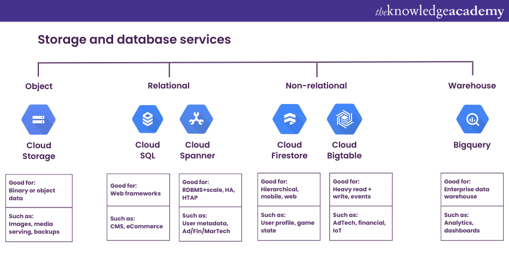
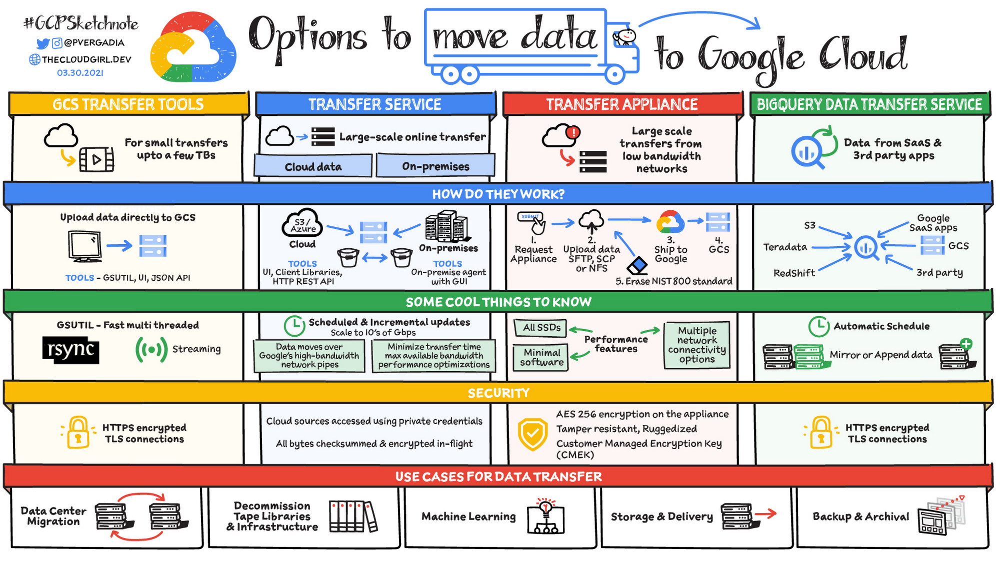

# Storage in Google Cloud
- [Storage in Google Cloud](#storage-in-google-cloud)
  - [Storage Solutions](#storage-solutions)
    - [Cloud Storage (GCS)](#cloud-storage-gcs)
    - [Cloud Filestore](#cloud-filestore)
  - [Data Transfer Methods](#data-transfer-methods)
    - [Transfer Appliance](#transfer-appliance)
    - [Storage Transfer Service](#storage-transfer-service)
    - [BigQuery Data Transfer Service](#bigquery-data-transfer-service)
    - [gsutil and Browser Tools](#gsutil-and-browser-tools)
  - [Encryption and Security](#encryption-and-security)
  - [References](#references)

Google Cloud Platform offers a variety of storage solutions and data transfer methods to cater to different needs. Let's explore these options using relatable examples and dive deep into key concepts.

## Storage Solutions

### Cloud Storage (GCS)

Imagine Cloud Storage as a vast, intelligent warehouse where you can store virtually unlimited amounts of stuff. It's like having a magical closet that never runs out of space!

**Key Features:**
- **Buckets:** Think of these as labeled containers. You might have a bucket for "Family Photos" and another for "Work Documents."
- **Objects:** These are the individual items you store, like a specific photo or document.
- **Versioning:** It's like having a time machine for your files. If you accidentally overwrite your resume, you can go back and retrieve the previous version.
- **Lifecycle Management:** Imagine a smart assistant that automatically moves your summer clothes to storage when winter comes. You can set rules like "Move photos older than 1 year to colder storage" or "Delete draft documents after 30 days."

**Storage Classes:**
Picture a hotel with different room types, each suited for specific needs:
1. **Multi-Regional:** The penthouse suite, available worldwide. Perfect for frequently accessed data like popular website content.
2. **Dual-Region:** A room in two connected hotels, offering high availability across two regions.
3. **Regional:** A standard room in one location. Good for data that needs to stay close to compute resources in the same region.
4. **Nearline:** Like a storage unit you visit monthly. Ideal for backups you don't need often.
5. **Coldline:** A remote storage facility you access quarterly. Great for disaster recovery data.
6. **Archive:** The deepest vault, accessed yearly. Perfect for long-term archival data.

### Cloud Filestore

Think of Filestore as a shared network drive for your cloud computers. It's like having a central filing cabinet that multiple office workers can access simultaneously.

**Key Points:**
- Multiple virtual machines can read and write to it.
- Consistent performance, like a well-oiled filing system.
- Not compatible with serverless options like Cloud Functions or App Engine.

## Data Transfer Methods

### Transfer Appliance

Imagine you're moving to a new house across the country. Instead of making multiple trips with your car, you rent a giant moving truck. That's what Transfer Appliance is like for your data.

- Useful for massive amounts of data (100TB or 480TB).
- Physically shipped to Google after you load your data.
- Ideal when uploading would take more than a week.

### Storage Transfer Service

This is like hiring a professional moving company to transfer your belongings from one storage unit to another. It can move data between cloud providers or from on-premises to Google Cloud.

### BigQuery Data Transfer Service

Picture this as a specialized courier service for your business analytics data. It regularly picks up data from various sources and delivers it straight to your BigQuery data warehouse.

### gsutil and Browser Tools

These are like having a Swiss Army knife for data management. Use them for smaller transfers (under 1TB) with commands similar to Linux file management.

## Encryption and Security

Google Cloud offers various levels of security for your data, much like different types of safes:

1. **Default Encryption:** Every piece of data gets a basic level of protection automatically.

2. **Customer-Managed Encryption Keys (CMEK):** You get to hold the master key to the safe, but Google still manages the individual box keys inside.

3. **Customer-Supplied Encryption Keys (CSEK):** You bring your own locks to the storage facility. Google never sees or stores your keys.

4. **External Key Manager (EKM):** Like hiring a trusted security company to manage your keys separately from the storage facility.

5. **Client-Side Encryption:** You lock everything up before even bringing it to the storage facility. Google has no idea what's inside your boxes.

Remember, each of these options comes with different levels of control and responsibility. The more control you want, the more you need to manage yourself!

## References
- [Google Cloud Storage Lifecycle](https://cloud.google.com/storage/docs/lifecycle?authuser=4)
- [Google Cloud Storage - K21 Academy](https://k21academy.com/google-cloud/google-cloud-storage/)
- [Google Cloud Storage Bucket Lifecycle Rules: How to Change Them](https://bluexp.netapp.com/blog/google-cloud-storage-bucket-lifecycle-rules-how-to-change-them)
- [What encryption is used for storage?](https://www.googlecloudcommunity.com/gc/Infrastructure-Compute-Storage/What-encryption-is-used-for-storage/m-p/683087)
- [Google Transfer Appliance](https://www.techtarget.com/searchcloudcomputing/definition/Google-Transfer-Appliance)
- [Google Cloud Platform Filestore - GeeksforGeeks](https://www.geeksforgeeks.org/google-cloud-platform-filestore/)
- [Transfer Appliance Overview](https://cloud.google.com/transfer-appliance/docs/4.0/overview)
- [Google Cloud Filestore](https://cloud.google.com/filestore?hl=en)
- [Transfer Appliances for Simple, Secure, Performant Data Movement](https://cloud.google.com/blog/products/storage-data-transfer/transfer-appliances-for-simple-secure-performant-data-movement)

[Computing in Google Cloud](<Part 5.md>)💻